---
## Front matter
lang: ru-RU
title: Лабораторная работа №12
subtitle: Администрирование локальных сетей
author:
  - Ищенко Ирина
institute:
  - Российский университет дружбы народов, Москва, Россия

## i18n babel
babel-lang: russian
babel-otherlangs: english

## Formatting pdf
toc: false
toc-title: Содержание
slide_level: 2
aspectratio: 169
section-titles: true
theme: metropolis
header-includes:
 - \metroset{progressbar=frametitle,sectionpage=progressbar,numbering=fraction}
---

## Докладчик

:::::::::::::: {.columns align=center}
::: {.column width="70%"}

  * Ищенко Ирина Олеговна
  * 1132226529
  * уч. группа: НПИбд-02-22
  * Факультет физико-математических и естественных наук

:::
::: {.column width="30%"}

:::
::::::::::::::

## Цель работы

Приобретение практических навыков по настройке доступа локальной сети к внешней сети посредством NAT.

# Выполнение лабораторной работы

##

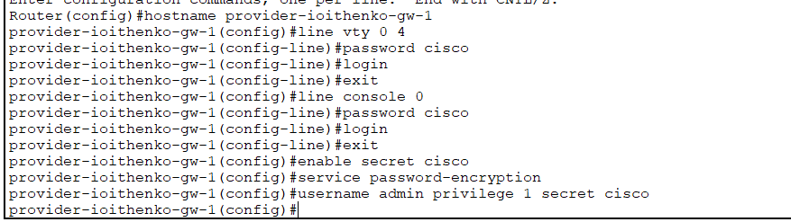{#fig:001 width=70%}

##

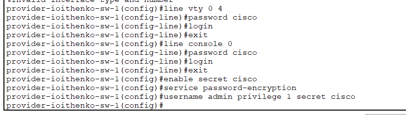{#fig:002 width=70%}

##

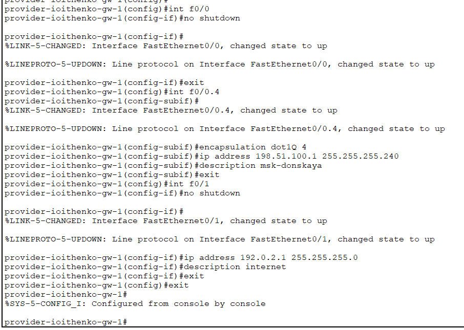{#fig:003 width=70%}

##

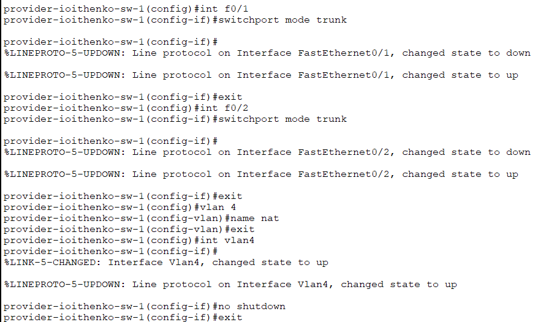{#fig:004 width=70%}

##

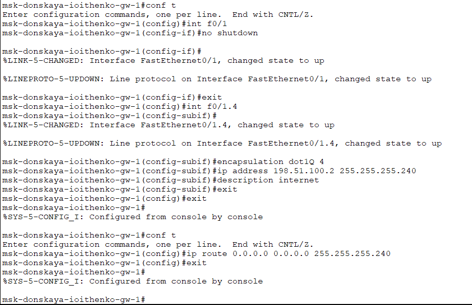{#fig:005 width=70%}

##

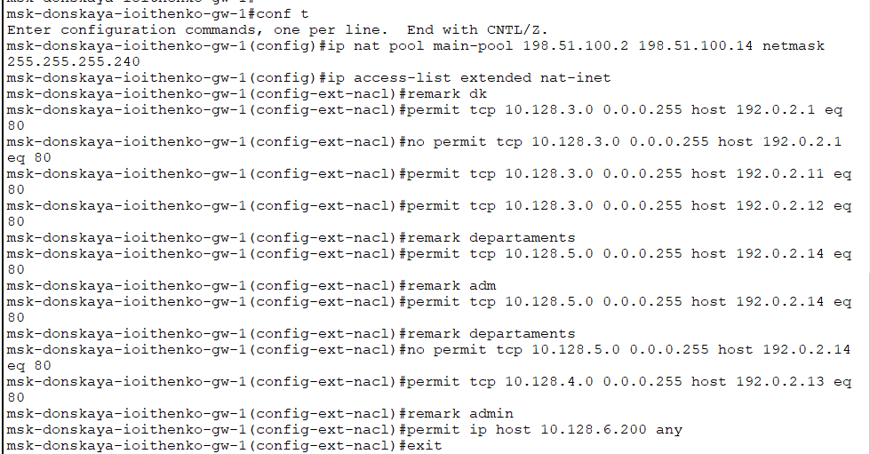{#fig:006 width=70%}

##

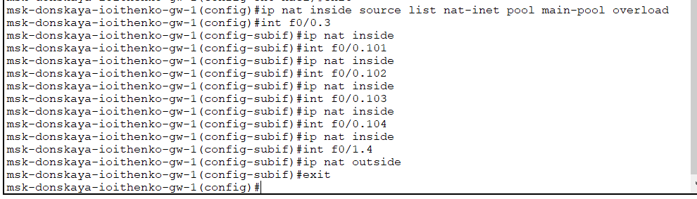{#fig:007 width=70%}

##

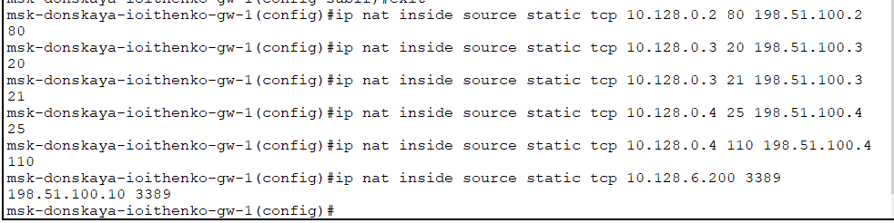{#fig:008 width=70%}

##

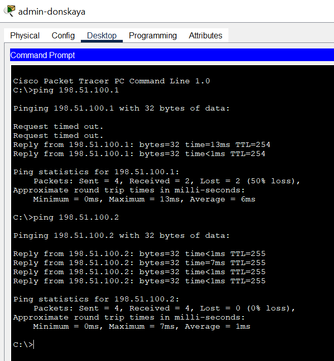{#fig:009 width=70%}

##

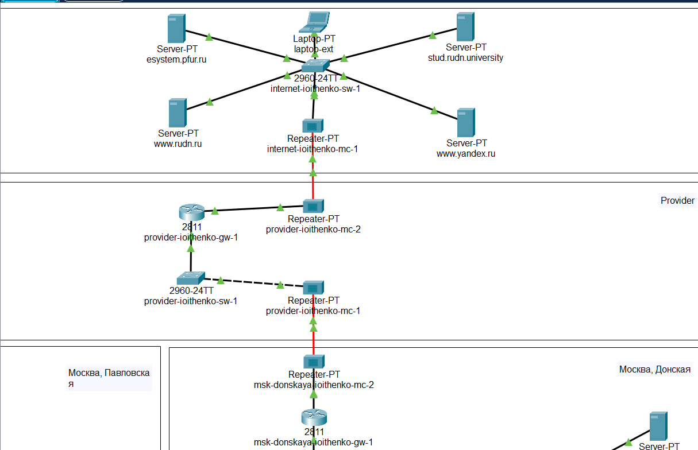{#fig:0010 width=70%}

##

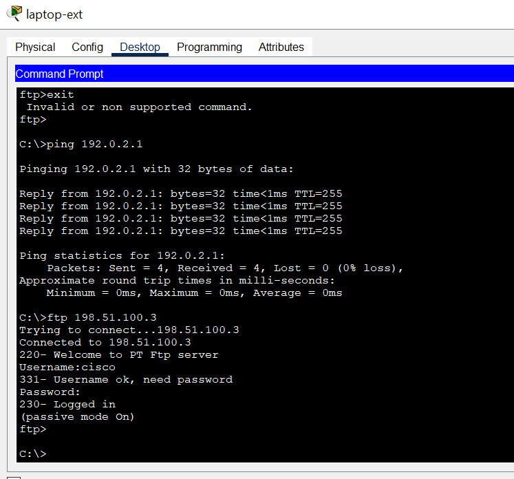{#fig:0011 width=70%}

##

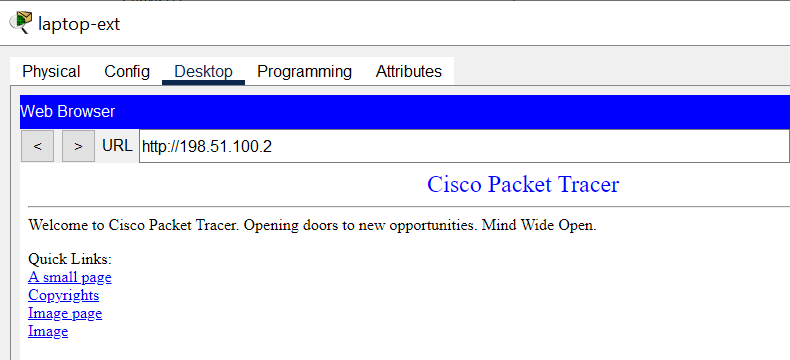{#fig:0012 width=70%}

##

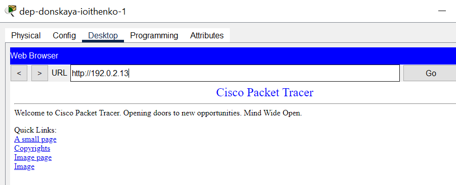{#fig:0013 width=70%}

##

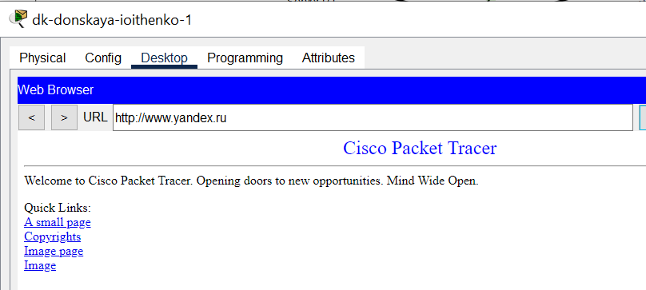{#fig:0014 width=70%}

##

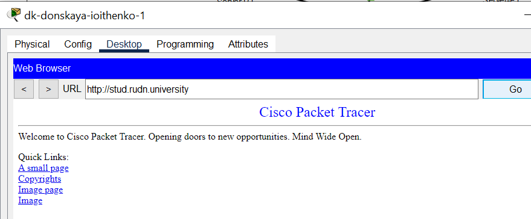{#fig:0015 width=70%}

##

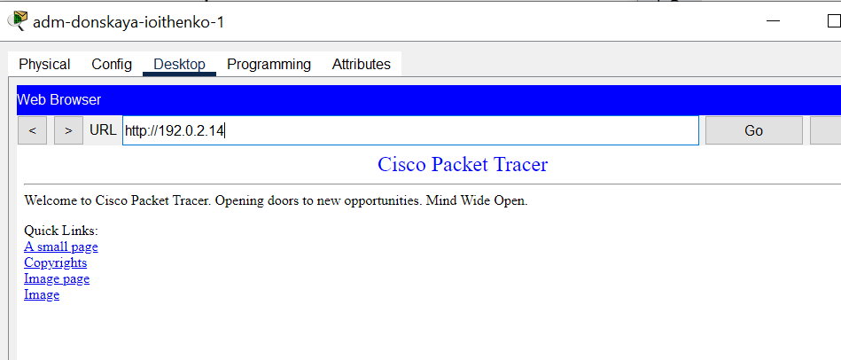{#fig:0016 width=70%}

## Выводы

В ходе выполнения лабораторной работы я приобрела практические навыки по настройке доступа локальной сети к внешней сети посредством NAT.
